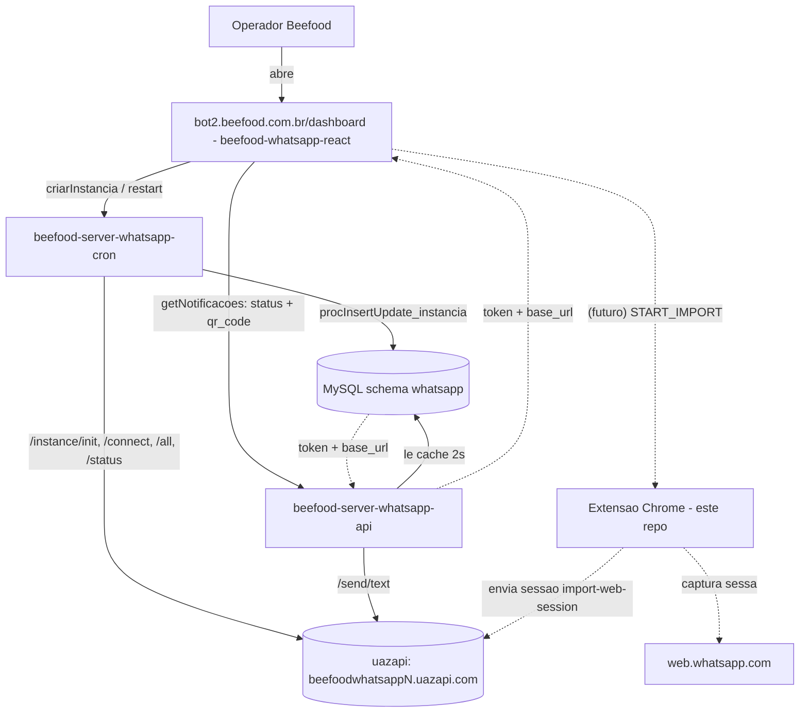

# Ecossistema Beefood + uazapi — mapa completo

> Este documento é a fonte da verdade sobre como os projetos se conectam. Serve de
> contexto para qualquer trabalho no fork da extensão. Atualize quando descobrir algo novo.

## Visão geral

O objetivo do ecossistema é conectar o WhatsApp de cada restaurante/filial a uma
instância **uazapi**, para que o BeeBot (chat/automação) funcione. A extensão deste
repositório entra como um caminho alternativo/complementar ao QR Code: em vez de
escanear o QR, ela **migra uma sessão já autenticada** do WhatsApp Web direto para a
instância uazapi.



## Projetos e caminhos locais

| Projeto | Caminho | Papel |
|---------|---------|-------|
| Extensão (este repo) | `C:\projetos\whatsapp-web-session-importer-uazapi` | Captura sessão do WhatsApp Web e envia para a uazapi |
| Frontend | `C:\projetos\beefood-whatsapp-react` | `bot2.beefood.com.br/dashboard` — UI de conexão (QR) |
| API | `C:\projetos\beefood-server-whatsapp-api` | API de chat + expõe status/instâncias |
| Cron | `C:\projetos\beefood-server-whatsapp-cron` | Ciclo de vida das instâncias uazapi |

## 1. Extensão (`whatsapp-web-session-importer-uazapi`)

- Fork da extensão oficial da uazapi. Ver `spec.md` e `DEVELOPERS.md`.
- **3 contextos:**
  1. Página SaaS/uazapi → `app-bridge.js` (detecção + comando de abertura).
  2. WhatsApp Web → `autofill.js` (painel flutuante, lê `#client=&token=`).
  3. Service worker → `background.js` (captura, conversão, upload em chunks, limpeza).
- **Fluxo atual:** operador digita "Nome da assinatura" (`client` = subdomínio) e
  "Token" no painel → captura → envia para `https://<client>.uazapi.com/instance/import-web-session/*`.
- **Bridge (postMessage):** hoje só ativa em `https://*.uazapi.com/*`.
  - Site → `PING` → extensão responde `CONNECTOR_READY` (+ versão).
  - Site → `START_IMPORT { client, token }` (alias `OPEN_WHATSAPP`) → extensão abre
    `web.whatsapp.com/#client=...&token=...`.
- **Ponto único de customização:** `src/customization.ts`
  (marca/textos, `api.clientBaseDomain`, `api.paths`, `api.authHeaderName`,
  `appBridge.matches`, limites de chunk/histórico, default de histórico).

### Contrato HTTP com a uazapi (por instância)

Base: `https://<subdomínio>.uazapi.com` — header de auth: `token: <token da instância>`.

```
GET  /instance/status                          # valida (deve estar desconectada/importando)
POST /instance/import-web-session/start        # -> { jobId }
POST /instance/import-web-session/chunk        # { jobId, section, seq, count, sha256, payload }
POST /instance/import-web-session/finish       # { jobId } -> pode retornar connect_queued
POST /instance/import-web-session/history      # âncoras de histórico (opcional, pós-sessão)
```

## 2. Frontend (`beefood-whatsapp-react`)

- **Stack:** Vite `^5.4.19`, React `^18.3.1`, TS `^5.8.3`, react-router `^6.30.1`,
  @tanstack/react-query `^5.83.0`, shadcn/ui + Tailwind. Dev server porta `8080`.
- **Gerado via Lovable.** Sem `.env`: URLs e Basic Auth **hardcoded** em `src/services/api.ts`.
- **Conexão hoje = 100% QR Code** em `src/components/WhatsAppConnectionModal.tsx`:
  1. Ao abrir o modal → `api.criarInstancia(empresaID, filialID)` (chama o cron).
  2. Polling 2s em `api.getNotificacoes(empresaID)` → lê `qr_code` e `status`.
  3. Renderiza ``; ao `status === 'connected'` → confete e fecha.
- `AuthContext.tsx` faz polling global 3s para status dos avatares no header.
- **Identidade da instância = `empresaID` + `filialID`** (não há `client`/`subdomain` na UI).

### DADO-CHAVE para a automação

O tipo `Instancia` (`src/types/index.ts`) já recebe do backend:

```ts
export interface Instancia {
  id: number; empresaID: number; filialID: number;
  token: string;         // <- token da instância uazapi
  status: string; qr_code: string | null;
  base_url: string;      // <- ex.: https://beefoodwhatsappN.uazapi.com
}
```

Ou seja, **`token` e `base_url` (o "client"/subdomínio) já chegam ao navegador do
operador** via `getNotificacoes`, mas hoje o front os **ignora**. Isso viabiliza a
automação por bridge sem o operador digitar nada.

### URLs relevantes (`src/services/api.ts`)

```
whatsapp-cron.beetechapi.be/api/rest/whatsapp/instancia/{empresaID}/{filialID}         (POST criar)
whatsapp-cron.beetechapi.be/api/rest/whatsapp/instancia/restart/{empresaID}/{filialID} (POST restart)
whatsapp-api.beetechapi.be/api/rest/whatsapp/notificacao/{empresaID}                    (GET status+qr+instancias)
```

Ponto natural de integração da extensão: `WhatsAppConnectionModal.tsx`.

## 3. API (`beefood-server-whatsapp-api`)

- **Stack:** Express `^4.17.1` (CommonJS), axios, mysql, basic-auth. Entrada `node index.js`.
  Porta `3825` (ou `8080` se `process.env.PORT`). Sem script `start`.
- Focada em **chat** (conversas/mensagens/notificações). Integração uazapi = só `/send/text`.
- `GET /whatsapp/notificacao/:empresaID` retorna `dadosInstancias` (com `token` e `base_url`).
- **Não** tem endpoints de instância/connect/QR nem `import-web-session`.
- Lê `whatsapp.instancia` via cache (atualizado a cada 2s por `notificacaoCron.js`).
- `createUazapiAPI(base_url, { headers: { token } })` em `src/models/uazapi/uazapiAPI.js`
  é a base reaproveitável caso se implemente um gateway `importKey` no futuro.

## 4. Cron (`beefood-server-whatsapp-cron`)

- **Stack:** Node/Express (CommonJS), `cron`, axios, mysql, mssql, ffmpeg, groq-sdk.
  `npm start` = `node --max-old-space-size=4096 index.js`. Porta `3824` (ou `8080`).
- Gerencia ciclo de vida das instâncias uazapi:
  - `init()` → escolhe servidor uazapi com menos conexões (`GET /instance/all`) →
    `POST /instance/init` → persiste → `POST /instance/connect`.
  - Instância na uazapi nomeada **`{empresaID}_{filialID}`**.
  - Headers uazapi: `token` (instância) + `admintoken` (servidor).
  - **Watchdog:** `connectCounter` — após **20** `connect()` seguidos → `deleteInstance`.
  - Reconexão: `processaDisconnectedInstances()` faz **delete + init** de instâncias `disconnected`.
  - Limpezas agendadas 05:00 / 13:30 (free plan, disconnected/connecting presos).
- Status vem de webhooks gravados em `whatsapp.fila_connection` (produtor externo).
- Servidores uazapi: tabela `whatsapp.server` (`url`, `admin_token`, `ativo`) +
  lista hardcoded `beefoodwhatsapp1..11.uazapi.com` em `uazapiInstances.js`.

## Modelo de dados (MySQL schema `whatsapp`)

| Tabela | Campos-chave | Uso |
|--------|--------------|-----|
| `instancia` | `empresaID`, `filialID`, `token`, `base_url`, `status`, `qr_code`, `owner`, `envios`, `recebimentos` | Mapa filial → uazapi |
| `server` | `url`, `admin_token`, `ativo` | Servidores uazapi |
| `fila_connection` | JSON com `instance`, `token`, `BaseUrl` | Webhooks de status |
| `fila` | `instanceName`, `baseUrl` | Mensagens recebidas |
| `conversa` / `mensagem` / `notificacao` | `empresaID`, `filialID`, `telefone` | Chat |

Escrita da instância: stored procedure `whatsapp.procInsertUpdate_instancia(empresaID, filialID, status, token, qr_code, base_url)`.

## Pontos de atenção para a integração

1. **Reconexão automática do cron pode conflitar com sessão importada.** Após um
   import bem-sucedido, o status precisa refletir `connected` (via `fila_connection`
   ou update em `whatsapp.instancia`) para o cron não fazer delete+init e derrubar a
   sessão recém-migrada.
2. **Nomeação da instância** é `{empresaID}_{filialID}` — qualquer fluxo novo deve respeitar.
3. **`subdomain`/`client` não existe explícito**; o equivalente é o `base_url`
   (`https://<sub>.uazapi.com`). A extensão aceita tanto nome curto quanto URL completa
   como `client` (ver `normalizeBaseUrl` em `src/shared/url.ts`).
4. **Token no navegador:** a abordagem escolhida (bridge direta) faz o `token` trafegar
   no navegador do operador. É aceitável por ser máquina do operador; a alternativa
   `importKey + gateway` (mais segura) exige mudanças na API. Ver plano.

## Decisão de arquitetura de integração escolhida

**Bridge direta:** habilitar a bridge da extensão em `https://*.beefood.com.br/*` (cobre
`bot2.beefood.com.br/dashboard`) e
fazer o frontend enviar `START_IMPORT { client: base_url, token }` usando os dados que
já recebe de `getNotificacoes`. A extensão automatiza o resto no WhatsApp Web.
(Alternativa `importKey + gateway` fica documentada como evolução futura.)
